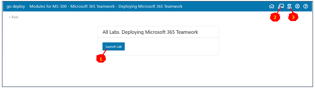
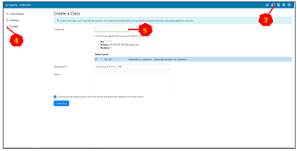
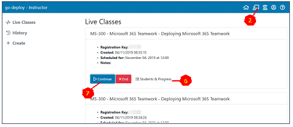
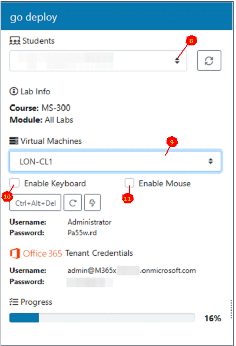
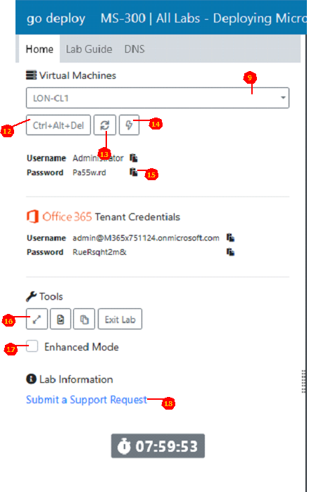
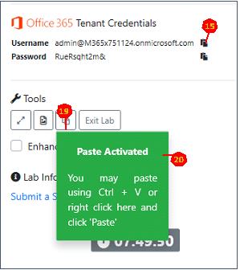
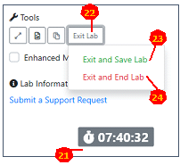
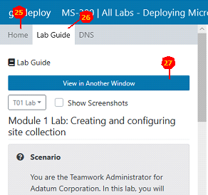
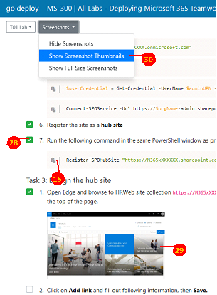
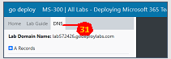

# Plateforme goDeploy
Les ateliers en ligne goDeploy sont particulièrement pratiques mais toutes leurs fonctions ne sont pas forcément intuitives. Le présent document a pour but d’aider les formateurs ib à appréhender cette plateforme et à la présenter aux stagiaires.  
## Contenu de ce document
- [L'interface formateur](https:#linterface-formateur)
- [L'interface stagiaire](https:#linterface-stagiaire)
- [Clavier dans les VMs](https:#clavier-dans-les-vms)
- [Copier/coller dans les VMs](https:#copiercoller-dans-les-vms)
- [Conserver/Terminer un atelier](https:#conserverterminer-un-atelier)
- [Les instructions d'atelier](https:#les-instructions-datelier)  

Il est impératif que chaque formateur MCT ait, avant animation, [demandé un accès à la plateforme goDeploy](https://aka.gd/MCTRequest). Cet accès permet de lancer n’importe quel atelier de l’offre goDeploy (préparation de stage/ateliers avant animation) et permettra donc également de présenter l’interface de l’outil aux stagiaires en début de session.  
La suite de ce document suppose que le formateur a un compte lui permettant d’accéder aux ateliers de la plateforme goDeploy.  
Il faudra, en début de session, inviter les stagiaires à se rendre sur le lien [lms goDeploy](https://lms.godeploy.it/) et à cliquer sur "**Register**" afin de créer un compte. Ensuite, ils pourront cliquer sur le bouton "**Register for a lab**" et rentrer le code fourni par ib (ou l’éventuel organisme partenaire). ***Le formateur ne doit en aucun cas utiliser le code fourni*** dans cette interface. L’interface suivante apparait alors :  
  
En cliquant sur le bouton **1**, on lancera la création des machines virtuelles de l’atelier.  
## L’Interface Formateur
Les boutons **2** et **3** ne sont présents que dans l’interface du formateur, ils permettent de basculer entre l’interface identique à celle des stagiaires (**3**) pour expliquer l’utilisation de la plateforme ou faire des démonstrations par exemple et l’interface formateur (**2**) par laquelle nous allons commencer :  
  
En cliquant sur "Create" (**4**) le formateur pourra créer une instance de stage pour chaque atelier utilisé durant la formation (en faire plusieurs et utiliser les "Notes" pour différencier si plusieurs codes commandés). C’est le seul endroit ou le formateur aura à rentrer le code (**5**) mentionné précédemment.  
Une fois le (ou les) stage(s) créé(s), la page formateur (**2**) comportera la liste des stages :  
  
En cliquant sur le bouton "Students & Progress" (**6**), il sera possible d’accéder à la liste des stagiaires ayant activé le code correspondant et leur progression dans l’atelier (voir plus loin / pour les stages prenant en charge cette fonction).  
En cliquant sur le bouton "Continue" (**7**), on accédera à une page permettant au formateur de voir/interagir avec les machines virtuelles des stagiaires.  
  
Cette page est assez similaire à celles des stagiaires dont le contenu sera expliqué plus loin. Voici les différences notables :  
- Il est possible de sélectionner (**8**) le stagiaire à afficher, puis choisir la machine virtuelle (**9**) à afficher.
- En cliquant sur le bouton **10**, le contrôle du clavier est pris par la machine du formateur.
- En cliquant sur le bouton **11**, le contrôle de la souris est pris par la machine du formateur.
- Si aucune de ces cases n’est cochée, la machine virtuelle choisie est simplement affichée. 
## L’interface Stagiaire
Cette partie du document est la plus importante : elle a pour but d’expliquer au formateur utilisant une plateforme goDeploy les subtilités de celle-ci, mais devrait aussi permettre à cet animateur de présenter la plateforme aux stagiaires.  
L’interface de travail principale est la page stagiaire:  
  
- La partie droite de la page contient l’interface de la machine virtuelle (VM) sélectionnée par le menu idoine (**9**).
- Comme son nom l’indique, le bouton **12** envoie un Ctrl-Alt-Suppr dans la VM.
- Le bouton **13** permet de se reconnecter à la VM en cas de problème.
- Le bouton **14** permet d’allumer/éteindre la VM si nécessaire.
- Partout où l’icône **15** apparaît, il sera possible de coller le texte correspondant dans la VM. (En cliquant ici, par exemple, on saisira automatiquement le mot de passe "Pa55w.rd" de l’administrateur).
- Le bouton **16** fait simplement passer le navigateur en plein écran pour gagner de la place sur l’affichage.
- Le bouton **17** permet de passer en "Enhance Mode". Celui-ci est déconseillé car, s'il est plus confortable (la VM prendra toute la place écran disponible), il n’est pas disponible pour tous les utilisateurs de la VM, car il s’appuie sur une connexion RDS (par défaut, pas disponible pour un compte non administrateur).
- En cliquant sur le lien **18**, on pourra faire une demande de support goDeploy (plutôt réactif) en cas de besoin.
## Clavier dans les VMs
Bien que la langue du clavier dans les VM soit affichée comme anglaise "**EN**", il ne faut surtout pas la modifier, sous peine de se retrouver avec une configuration complètement inexploitable, à mi-chemin entre le clavier "AZERTY" et "QWERTY".  
C’est la plateforme logicielle de goDeploy qui gère l’association correcte de la langue de clavier.
## Copier/coller dans les VMs
  
En plus de la présence de l’icône **15** permettant de coller un texte prévu par goDeploy dans la VM, il est possible de copier n’importe quel texte vers la VM :
1. Pour ce faire, commencer par copier (clic-droit/copy) le texte voulu.
1. Ensuite, cliquer sur le bouton **19**. 
1. Une fois que l’encadré vert **20** apparaît, procéder au collage avec la combinaison de touches **Ctrl-V** (attention : ne pas cliquer dans la VM, ce qui ferait disparaitre l’encadré vert **20** !).
## Conserver/terminer un atelier.
  
Sur la plateforme goDeploy, les VMs des ateliers sont maintenues en fonction pendant un temps indiqué par le compteur **21**.  
Il faudra cliquer sur le bouton **22** pour quitter son lab.  
En choisissant "Exit Lab/Save Lab" **23**, le compteur **21** sera remis à zéro et l’atelier sera maintenu en l’état pendant une durée maximum de 4 jours. Il sera donc impératif de réaliser cette sauvegarde pour tout atelier devant dépasser la durée du compteur **21**.  
En choisissant "Exit Lab/End lab" **24**, l’atelier sera détruit et pourra être réinstancié au besoin pendant 6 mois (180 jours). 
## Les instructions d’atelier
Les instructions de réalisation des ateliers à suivre ne sont pas dans le support de stage officiel mais hébergées par la plateforme. Il faudra donc cliquer sur l’onglet **26** pour y accéder.  
  
Il est (très) fortement conseillé d’utiliser le bouton **27** afin d’ouvrir ces instructions dans une autre fenêtre de navigateur pouvant être placée sur un second écran.  
Une fois cette seconde fenêtre ouverte, il est recommandé de cliquer sur l’onglet **25** de la fenêtre principale pour revenir sur l’interface proposant les outils de travail.  
  
Dans la fenêtre d’instructions, on trouvera parfois l’icône **15** permettant de coller directement les commandes dans la VM.  
Pour les stages que prennent cette fonction en charge, le fait que chaque stagiaire coche les cases de suivi du stage **28** permet au formateur d’en suivre la progression (dans son interface décrite en début de document).  
Afin que les copie d’écran **29** ne monopolisent par trop l’attention des stagiaires (dans presque tous les cas, le texte sera plus important / à jour). Il est conseillé de ne les afficher qu’en miniature **30**.  
  
Pour certains stages, des pages de configuration supplémentaires sont accessibles depuis des onglets spécifiques comme le DNS **31** ici.  
Les stagiaires seront guidés sur leur utilisation dans les instructions d’atelier.
