# Mise en place d'un environnement d'ateliers *ib* sur un compte Azure

## Objectifs
Le présent document explique comment mettre en place quelques ressources dans un compte Azure (*Azure Pass Sponsorship* par exemple). Ces procédures pourront, par exemple, être utilisées en début de formation pour simplifier le déroulement de vos ateliers par la suite...  
>:arrow_forward: **Nota 1:** L'objectif de ce document n'est pas pédagogique. Si vous êtes dans le contexte d'une formation de découverte d'Azure, ne cherchez pas à comprendre les étapes utilisées ici mais plutôt à les réaliser (avec l'aide éventuelle de votre formateur/trice si nécessaire).  

>:arrow_forward: **Nota 2:** Nous vous conseillons de réaliser dès le début de formation (au plus tard avant votre premier atelier) les procédures 0, 1 et 2. Les procédures 3 et 4 seront à suivre uniquement si vous en avez besoin/envie ou si votre formateur/trice vous l'indique.  

>:arrow_forward: **Nota 3:** Nous vous conseillons fortement d'utiliser, pour réaliser vos ateliers, un autre navigateur que celui que vous utilisez habituellement pour bien maitriser avec quel compte vous êtes connecté pour faire chaque action.  

Voici les procédures que nous vous proposons dans ce document:
 - ## [Procédure 0: Passer son compte Azure en anglais.](#proc%C3%A9dure-0-passer-son-compte-azure-en-anglais-1)
 - ## [Procédure 1: Créer quelques ressources génériques dans Azure.](#proc%C3%A9dure-1-cr%C3%A9er-quelques-ressources-g%C3%A9n%C3%A9riques-dans-azure-1)
 - ## [Procédure 2: Initialiser le Cloud Shell.](#proc%C3%A9dure-2--initialiser-le-cloud-shell)
 - ## [Procédure 3: Permettre l'accès Bastion à une VM.](#proc%C3%A9dure-3--permettre-lacc%C3%A8s-bastion-%C3%A0-une-vm)
 - ## [Procédure 4: Création d'une machine virtuelle administrative](#proc%C3%A9dure-4--cr%C3%A9ation-dune-machine-virtuelle-administrative)
---
# Procédure 0: Passer son compte Azure en anglais
Tous les labs officiels et tutoriels fournis par Microsoft le sont en langue anglaise.  
Il sera donc plus efficace d'avoir votre portail Azure dans cette même langue anglaise. Ce ne sera pas le cas si vous avez activé votre compte de test depuis un navigateur Internet configuré en Français. Voici donc les quelques étapes pour changer la langue de votre portail Azure :  
1. Connextez-vous sur le navigateur utilisé pour réaliser vos ateliers, ouvrez le [portail Azure (https://portal.azure.com)](https://portal.azure.com).  
1. Cliquez sur l'icône des paramètres en haut à droite du portail Azure.  
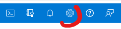  
3. Dans la page **Paramètres du portail** Sélectionnez l'affichage des **langues + région** en sélectionnant cet onglet (dans la liste à gauche)
4. Dans la page **Paramètres du portail \| Langue + région**, sélectionnez **English** dans le menu **Langue**
5. Cliquez sur **Appliquer** puis sur **OK** dans la fenêtre de confirmation qui indique que le portail sera rechargé.
6. Vous pouvez fermer la page des paramètres.  

[(Retour au Sommaire)](#objectifs)  
# Procédure 1: Créer quelques ressources génériques dans Azure
1. Cliquez (préférez ouvrir dans un autre onglet pour ne pas quitter le présent document) directement sur le bouton ci-dessous afin d'initialiser le déploiement des ressources dans Azure :  
[](https://portal.azure.com/#create/Microsoft.Template/uri/https%3A%2F%2Fraw.githubusercontent.com%2Frenaudwangler%2Fib%2Fmaster%2Fextra%2FarmTemplates%2FibAzureLabEnvironment.json)

1. Ce bouton, ouvre votre portail Azure.  
Si vous n'étiez pas encore connecté à votre compte Azure dans le navigateur Internet, procédez à la connexion.
1. Saisissez les informations suivantes dans la page **Custom Deployment** :  
   - **Subscription** : Sélectionnez votre abonnement Azure
   - **Resource group** : Cliquer sur **Create new** puis choisissez un nom (*ibLabs* par exemple) et cliquez sur **OK**
   - **Region** : Choisissez **East US** (ou tout autre région désignée par votre formateur/trice)
   - **Storage Account Name** : Vous pouvez taper un nom mondialement unique. Si vous laissez la formule par défaut, un nom unique sera généré, basé sur la date et l'heure de création.   
     |:warning:| Ce nom ne doit être composé que de minuscules et de chiffres !|
     |-|:-|
1. Cliquez en dehors du champ **Storage Account Name** pour vérifier que le nom choisi est unique et correct.  

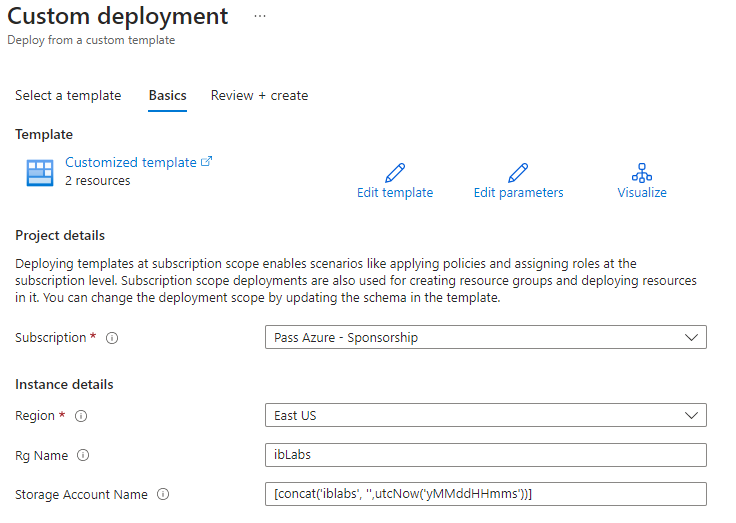  
1. Cliquez sur **review + Create**
1. Si la validation échoue, retournez sur l'onglet **Basics** pour corriger votre saisie, sinon cliquez sur **Create**
1. Attendez que le déploiement soit terminé avant de passer à la procédure suivante  
>:arrow_forward: **Nota:** Le déploiement va prendre quelques instants : Le plus simple est de rester sur la page **Template overview** jusqu'à ce que le bouton **Go to resource group** apparaisse.  

|:warning:|Le *resource group* créé est *vérouillé* pour empècher sa supression accidentelle. Si vous souhaitez supprimer une resource, il faudra supprimer le verrou/lock *ibLabVerrou*. Demandez de l'aide à votre formateur/trice si nécessaire.|  
|-|:-|

[(Retour au Sommaire)](#objectifs)   
# Procédure 2 : Initialiser le Cloud Shell  
>:arrow_forward: **Nota :** La réalisation de cette procédure suppose que vous avez correctement réalisé la [Procédure 1](#proc%C3%A9dure-1-cr%C3%A9er-quelques-resources-g%C3%A9n%C3%A9riques-dans-azure) précédente.  
1. Dans votre portail Azure, cliquez sur l'icône du **Cloud Shell** dans la barre des icônes en haut à droite.  
  
1. Cliquez sur "**Powershell**  
1. Au premier lancement du *Cloud Shell*, il faudra lier le *Storage Account* qui a été créé dans la procédure précédente. Pour ce faire, commencez par cliquer sur **Show Advanced Settings**  
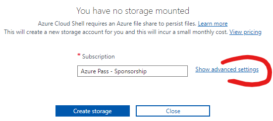  
1. Remplissez les **Advanced Settings** avec les valeurs suivantes :   
   - **Subscription** : Sélectionnez votre abonnement Azure,
   - **Region** : Sélectionnez **East US** ou tout autre région désignée par votre formateur/trice,
   - **Resource group** : Cliquez sur **Use existing** et choisissez le *Resource group* créé dans la [Procédure 1](#proc%C3%A9dure-1-cr%C3%A9er-quelques-resources-g%C3%A9n%C3%A9riques-dans-azure) précédente,
   - **Storage account** : Cliquez sur **Use existing** et choisissez le *Storage Account* créé par la [Procédure 1](#proc%C3%A9dure-1-cr%C3%A9er-quelques-resources-g%C3%A9n%C3%A9riques-dans-azure) précédente,
   - **File share** : Cliquez sur **Use existing** et saisissez la valeur "**cloudshell**".  

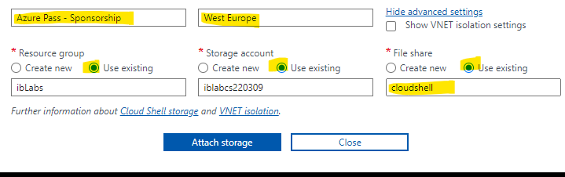  
1. Cliquez sur **Attach storage**. Logiquement, votre première session de *Cloud Shell* se lance.  
>:arrow_forward: **Nota :** Votre *Cloud Shell* est donc associé à un *Storage Account* qui se trouve dans votre *Resource group*. Ainsi, à la fin de chaque atelier, pour faire le ménage, vous pourrez supprimer tous les **autres** *Resource groups* et conserver celui créé par la [Procédure 1](#proc%C3%A9dure-1-cr%C3%A9er-quelques-resources-g%C3%A9n%C3%A9riques-dans-azure) précédente.  

[(Retour au Sommaire)](#objectifs)   
# Procédure 3 : Permettre l'accès *Bastion* à une VM  
Si vous ne pouvez/souhaitez pas accéder aux VMs Azure directement en RDP ou SSH depuis votre réseau/machine, vous pouvez utiliser la procédure suivante pour vous connecter à l'interface d'une VM Azure directement depuis votre navigateur.  
>:arrow_forward: **Nota 1 :** Cette procédure n'est pas à utiliser dans la foulée des précédentes. Il faudra vous y référer au besoin, lorsque vous souhaiterez accéder à une VM que vous aurez créée dans un atelier.  

>:arrow_forward: **Nota 2 :** La réalisation de cette procédure suppose que vous avez correctement réalisé la [Procédure 1](#proc%C3%A9dure-1-cr%C3%A9er-quelques-resources-g%C3%A9n%C3%A9riques-dans-azure) précédente.  

>:arrow_forward: **Nota 3 :** Azure Bastion est un service facturé par Microsoft. Si vous ne souhaitez pas/plus l'utiliser dans vos labs, nous vous conseillons de supprimer la resource **ibLabBastion**.  
1. Commencez par accéder au **Resource Group** créé par la [Procédure 1](#proc%C3%A9dure-1-cr%C3%A9er-quelques-resources-g%C3%A9n%C3%A9riques-dans-azure) précédente.
1. Dans la liste des ressources (moitié droite de l'écran), cliquez sur le *Template spec* **ibAzureLabBastion**  
1. Cliquez sur l'action **Deploy**  
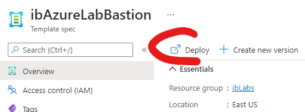  
1. Dans la page **Deploy ibAzureLabBastion (1.0)**, sélectionnez les valeurs suivantes :  
    - **Subscription** : Sélectionnez votre abonnement Azure,
    - **Resource Group** : Choisissez le *Resource group* créé dans la [Procédure 1](#proc%C3%A9dure-1-cr%C3%A9er-quelques-resources-g%C3%A9n%C3%A9riques-dans-azure) précédente,
     - **Region** : Laissez **East US** (ou tout autre région désignée par votre formateur/trice.  
1. Cliquez sur **Review + Create** puis, une fois la validation passée, cliquez sur **Create**  
1. Attendez que le déploiement soit terminé avant de passer à l'étape suivante  
>:arrow_forward: **Nota :** Le déploiement va prendre quelques minutes. Le plus simple est de rester sur la page **Template overview** jusqu'à ce que le bouton **Go to resource group** apparaisse.  
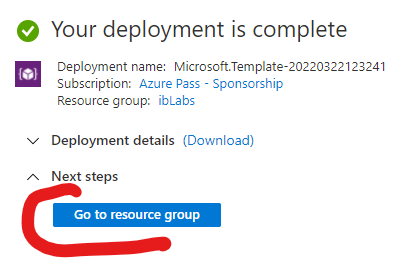  

7. Cliquez sur **Go to resource group**.
1. Dans la liste des ressources (moitié droite de l'écran), cliquez sur le *Virtual Network* **ibLabVnet**
1. Dans la page **ibLabVnet** Sélectionnez l'affichage des **Properties** en sélectionnant cet onglet (sous **Settings** dans la liste à gauche)  
1. Dans la page **ibLabVnet \| Properties**, copiez la valeur **Resource ID**, vous en aurez besoin dans un instant.
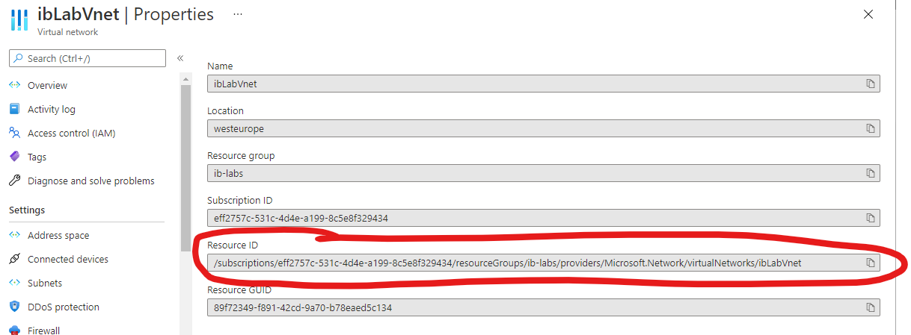  
1. Accédez à la VM à laquelle vous souhaitez vous connecter
1. Dans la page de la VM, sélectionnez l'affichage **Networking**, en sélectionnant cet onglet (sous **Settings** dans la liste à gauche)
1. Cliquez sur le nom du *Virtual Network* de votre machine virtuelle pour ouvrir celui-ci.  
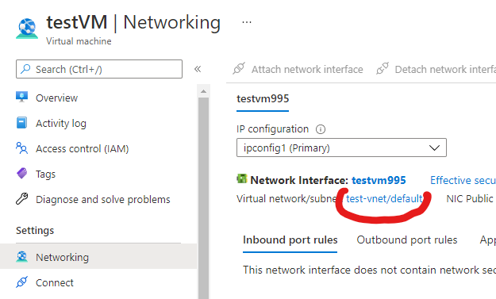  
1. Dans la page de votre *Virtual Network*, Sélectionnez l'affichage des **Peerings** en sélectionnant cet onglet (sous **Settings** dans la liste à gauche)
1. Dans la page **Peerings** de votre machine virtuelle, cliquez sur **+ Add** pour ajouter un nouveau *peering*.  
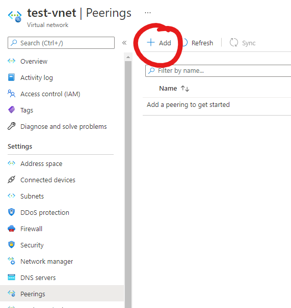  
1. Dans la page **Add peering**, saisissez les informations suivantes :
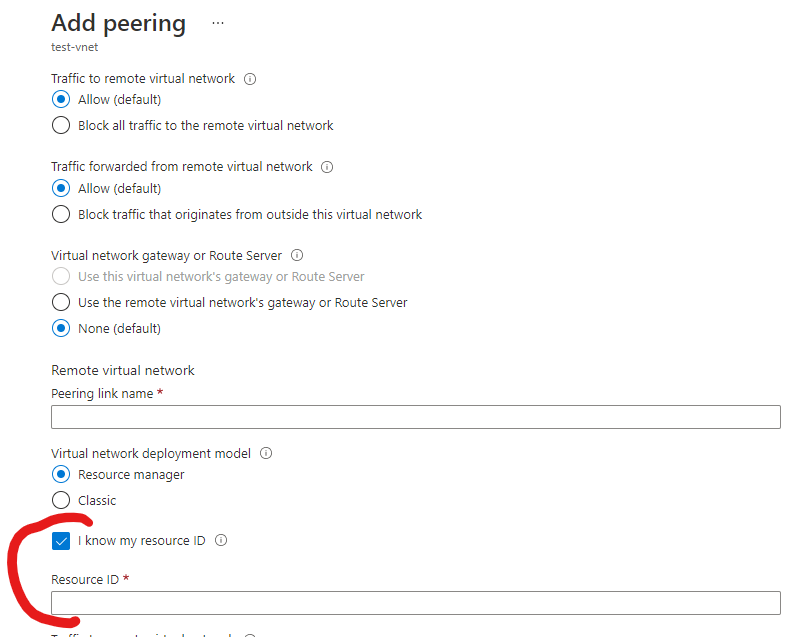  
   - Laissez chaque bouton radio à sa valeur par défaut.
   - **This virtual network / Peering link name** : Saisissez un nom unique représentatif (ex : *test-vnet_to_ibLabvNet*)
   - **Remote virtual network / Peering link name** : Saisissez un nom unique représentatif (ex : *ibLabvNet_to_test-vnet*)
   - **I know my resource ID** : Cochez la case
   - **Resource ID** : Coller l'identifiant du vNet copié au point 10 précédent.
 1. Cliquez sur **Add**
 1. Restez sur la page **Peerings**, patientez et utilisez le bouton **Refresh** jusqu'à ce que le **Peering status** soit passé en **Connected**
 1. Retournez à l'affichage de votre machine virtuelle (peut se faire en cliquant sur son nom dans les objets **Home > VM > vNet** au-dessus du titre de page **Peerings**).
 2. Dans la page de la VM, sélectionnez l'affichage **Overview**, en sélectionnant cet onglet (Le premier dans la liste à gauche)
 3. Cliquez sur le menu **Connect / Bastion**  
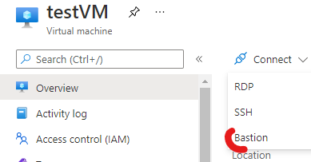  
 5. Dans la page **bastion** de votre machine virtuelle, vous devriez pouvoir saisir votre **username** et **Password** de connexion... ***et VOILA!***  
>:arrow_forward: **Nota** : Si ce n'est pas le cas mais que la création d'un *bastion* vous est proposée à la place, patientez et rafraichissez la page jusque voir apparaitre la mention "*using Bastion: **ibLabBastion**, Provisioning State: **Succeeded**".  

>:arrow_forward: **Nota 2** : Cette *Procédure 3* sera à répéter pour tout nouveau *Virtual Network* hébergeant une machine virtuelle à laquelle vous souhaiteriez vous connecter...  

>:arrow_forward: Astuce** : La commande suivante (qui peut être utilisée dans le *CloudShell*) connecte tous vos *Virtual Networks* actuels au *Virtual Network* permettant de faire la connexion *bastion*...
```pwsh
if ($ibLabVnet=Get-AzVirtualNetwork -Name ibLabVnet) {Get-AzVirtualNetwork|where name -notlike ibLabVnet|foreach {`
  $alterNet=$_;if(!(Get-AzVirtualNetworkPeering -VirtualNetworkName $alterNet.name -ResourceGroupName $alterNet.ResourceGroupName)) {`
    $newPeer=Add-AzVirtualNetworkPeering -Name "$($alterNet.name)_to_ibLabVnet" -VirtualNetwork $alterNet -RemoteVirtualNetworkId $ibLabVnet.id;echo $newPeer.name};`
  if(!((Get-AzVirtualNetworkPeering -VirtualNetworkName $ibLabVnet.name -ResourceGroupName $ibLabVnet.ResourceGroupName).RemoteVirtualNetwork|where id -eq $alterNet.id)) {`
    $newPeer=Add-AzVirtualNetworkPeering -Name "ibLabVnet_to_$($alterNet.name)" -VirtualNetwork $ibLabVnet -RemoteVirtualNetworkId $alterNet.id;echo $newPeer.name}}}
```  
[(Retour au Sommaire)](#objectifs)  
# Procédure 4 : Création d'une machine virtuelle administrative 
Si vous ne pouvez/souhaitez pas utiliser votre machine personnelle/professionnelle pour installer dessus divers outils d'administration/de développement, vous pouvez utiliser la procédure suivante pour vous créer simplement une machine virtuelle.  
>:arrow_forward: **Nota 1 :** Cette procédure n'est pas à utiliser dans la foulée des précédentes. Il faudra vous y référer au besoin, si vous avez besoin de créer la VM administrative, ou si votre formateur/trice vous y invite.  

>:arrow_forward: **Nota 2 :** La réalisation de cette procédure suppose que vous avez correctement réalisé la [Procédure 1](#proc%C3%A9dure-1-cr%C3%A9er-quelques-resources-g%C3%A9n%C3%A9riques-dans-azure) précédente.  
1. Dans la liste des ressources (moitié droite de l'écran), cliquez sur le *Template spec* **ibAzureLabVM**  
1. Cliquez sur l'action **Deploy**  
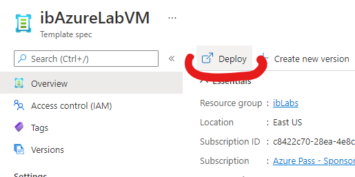  
1. Dans la page **Deploy ibAzureLabVM (1.0)**, sélectionnez les valeurs suivantes :  
    - **Subscription** : Sélectionnez votre abonnement Azure,
    - **Resource Group** : Choisissez le *Resource group* créé dans la [Procédure 1](#proc%C3%A9dure-1-cr%C3%A9er-quelques-resources-g%C3%A9n%C3%A9riques-dans-azure) précédente,
     - **Region** : Laissez **East US** (ou tout autre région désignée par votre formateur/trice.  
     - **Virtual Machine Size** : Laissez **Standard DS1 v2**, sauf si votre formateur/trice vous indique de changer cette valeur,  
     - **Admin Password** : La valeur par défaut est "**Pa55w.rd1234**", si vous la changez, notez la valeur choisie pour vous connecter ensuite à la VM.  
1. Cliquez sur **Review + Create** puis, une fois la validation passée, cliquez sur **Create**  
1. Une fois le déploiement terminé, vous pourrez vous connecter à votre nouvelle VM d'administration.  
>:arrow_forward: **Nota 1:** Le déploiement va prendre quelques minutes. Le plus simple est de rester sur la page **Template overview** jusqu'à ce que le bouton **Go to resource group** apparaisse.  
  

>:arrow_forward: **Nota 2:** Si vous ne voulez/pouvez pas vous connecter en RDP sur la machine virtuelle d'administration, vous pouvez vous y connecter en créant un *Bastion* en suivant les étapes **1** à **6** de la [procédure 3](#proc%C3%A9dure-3--permettre-lacc%C3%A8s-bastion-%C3%A0-une-vm).  
Ensuite, connectez-vous à votre VM en vous référant si nécessaire aux étapes **20** à **22** de la [procédure 3](#proc%C3%A9dure-3--permettre-lacc%C3%A8s-bastion-%C3%A0-une-vm).  

[(Retour au Sommaire)](#objectifs)
